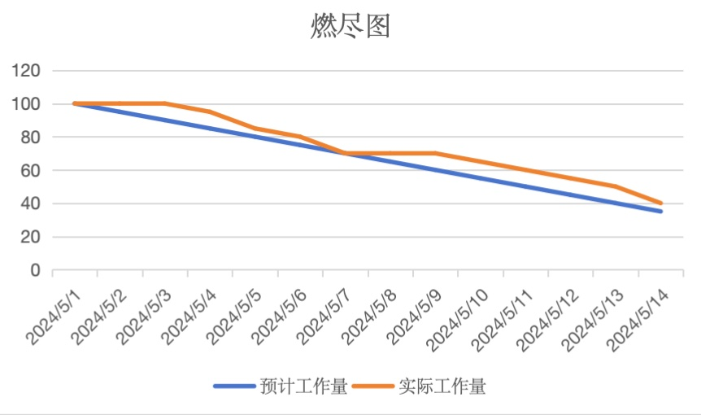

### 3.1 Sprint 燃尽跟踪
- **燃尽图的使用**：
  - 利用燃尽图来跟踪每个Sprint的进度，这是一种可视化工具，可以显示在Sprint周期内剩余工作量的减少情况。
  - 每日更新燃尽图，反映团队完成的任务和剩余的任务量，帮助识别是否有偏离初期计划的趋势。
  

- **Sprint 会议**：
  - 每个Sprint的开始进行Sprint规划会议，由产品负责人耿江云确定Sprint目标和任务优先级。
  - 每周站会，由Scrum Master于蕊宁组织，团队成员分享成就、计划和遇到的障碍。

- **调整与优化**：
  - 根据燃尽图和日常反馈，Scrum Master和产品负责人需评估项目进度和团队效率，适时做出调整，如资源重新分配、优先级调整或Sprint目标修正。

### 3.2 小组绩效统计
- **关键绩效指标（KPIs）的设定**：
  - 设定具体的KPIs，如代码提交频率、功能交付速度、缺陷率、测试覆盖率等，衡量团队和项目的表现。
  - 特别关注那些能直接反映功能完成情况和系统稳定性的指标。

- **定期绩效评审**：
  - 每个Sprint结束时，进行绩效回顾会议，由Scrum Master于蕊宁主持，讨论团队绩效，识别成功点和改进区域。
  - 产品负责人耿江云和项目团队一起评估项目里程碑是否达成，并根据实际情况调整项目目标。

- **反馈机制和持续改进**：
  - 实施一个开放的反馈机制，鼓励团队成员（葛菲、胡扬儿、张悦）提供正向和建设性的反馈。
  - 根据团队反馈和绩效数据，持续优化工作流程和团队交流。

通过这些策略，可以确保项目管理过程中的透明度和效率，同时通过持续的监控和调整，提高团队的整体表现和项目成功率。